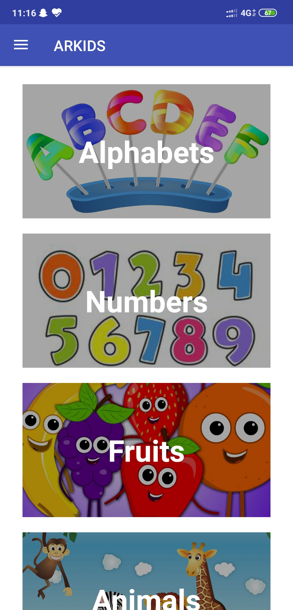
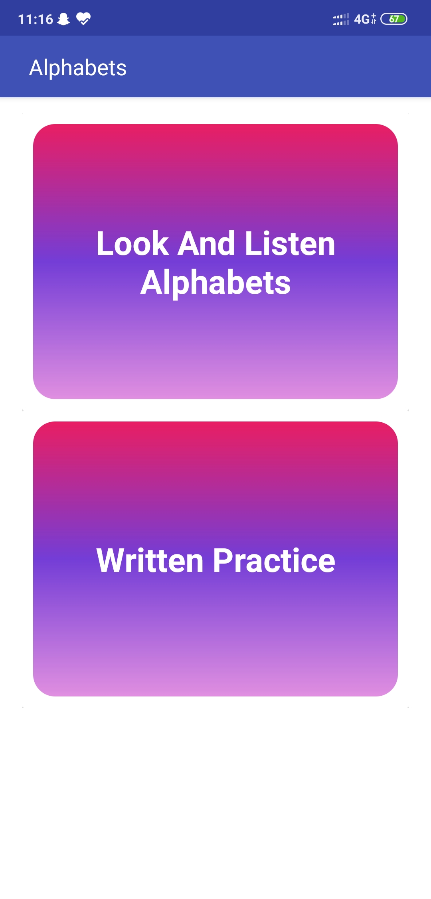
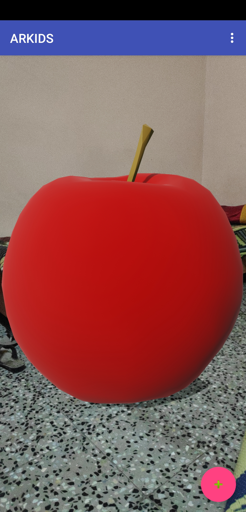
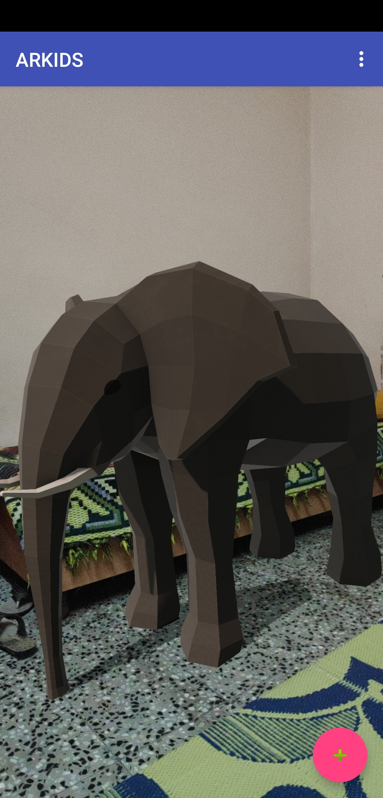
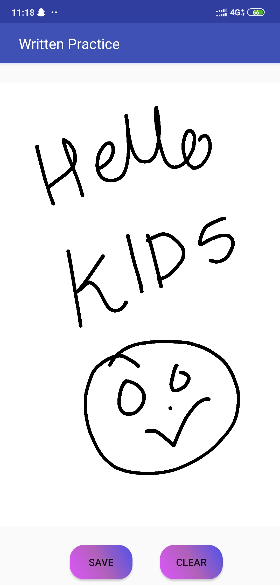
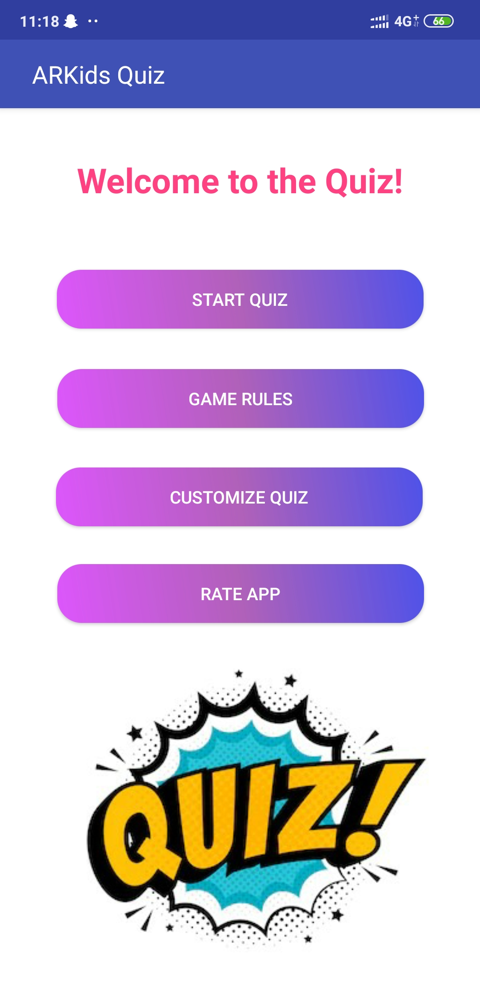
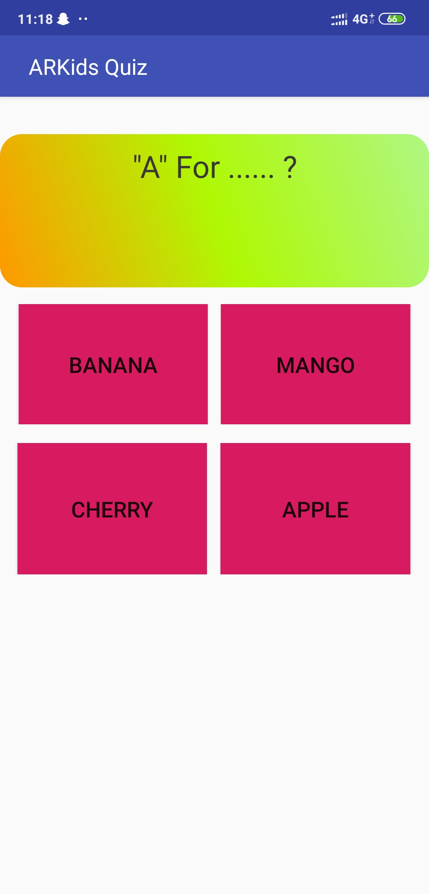
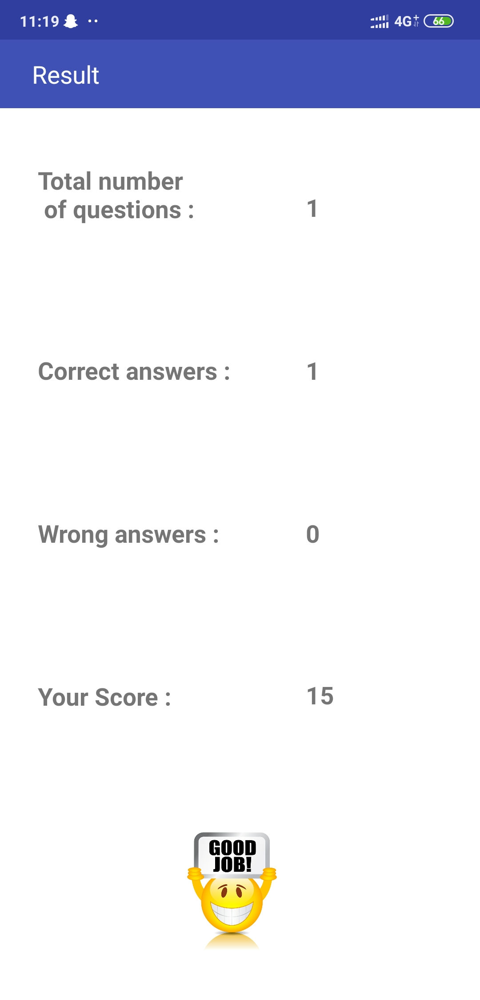
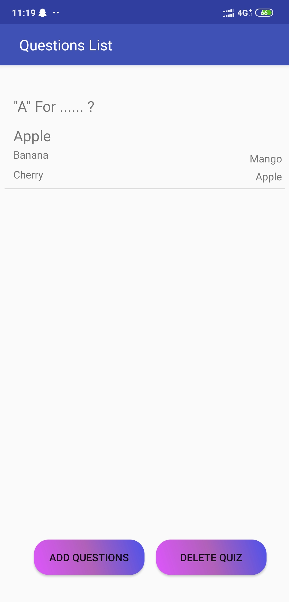
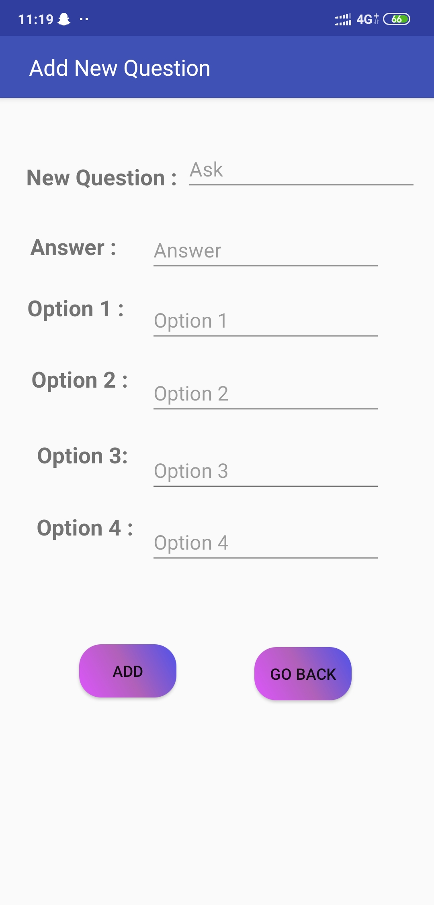

# AR_KIDS
This kids Learning App basically uses the concept of Augmented Reality. By using camera on the smartphone or tablet, the user or the child could view the superimposed virtual three dimensional (3D) objects and images in a fun and interactive manner.
The main objective of this system is to develop an interactive and more fun 3D kids learning app using AR. It is could enhance the children interaction on Learning physical book by creating Augmented Reality mobile application that contains interactive 3D objects and audio based on Specific Alphabets, Numbers, Animals, Fruits.
What is Augmented Reality (AR)?
AR is defined as the combination of real scenes and virtual scene. It means the real scenes is viewed by the user and the virtual scene is generated by a computer that arguments the scene with additional information.

Screen 1:

Screen 2:

Screen 3:

Screen 4:

Screen 5:

Screen 6:

Screen 7:

Screen 8:

Screen 9:

Screen 10:

